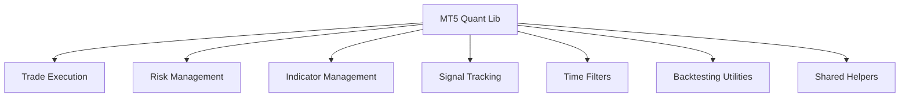

# MT5 Quant Lib

A reusable MQL5 library providing infrastructure components and utility classes for MetaTrader 5 development.

The library abstracts common functionality such as trade execution, risk management, indicator handling, signal tracking, and supporting utilities into reusable components.

The primary goal is to reduce duplicated implementation, improve maintainability, and provide a modular foundation for building Expert Advisors and trading systems.

---

## 🎯 Engineering Focus

This project was built to demonstrate:

- Reusable library design
- Object-oriented development
- Modular architecture
- Infrastructure abstraction
- Trade management utilities
- Risk-management systems
- Indicator abstraction layers
- Multi-symbol support
- Shared runtime components
- Separation of concerns

---

## 🛠️ Tech Stack

- **Language:** MQL5
- **Platform:** MetaTrader 5
- **Architecture:** Modular utility library
- **Testing:** MT5 Strategy Tester
- **Domain:** Trading infrastructure and system development

---

## 🔑 Core Library Components

The library provides reusable modules including:

- Trade execution utilities
- Position sizing components
- Risk management systems
- Stop-loss and take-profit management
- Indicator handle management
- Signal state tracking
- Time and session filters
- Multi-symbol support
- Backtesting utilities
- Shared helper functions

---

## 📈 Library Architecture

The library separates reusable infrastructure functionality into independent modules that can be combined as needed.

This approach improves:

- maintainability
- reusability
- modularity
- separation of concerns
- reduction of duplicated logic

---

## 🧩 Example Application

The repository also contains a small example Expert Advisor demonstrating how library components can be integrated and used in a practical application.

The example exists purely as a usage demonstration and is not the primary purpose of the repository.

---

## ⚠️ Current Limitations

- Designed specifically for MetaTrader 5
- Requires an MT5 environment
- Not intended as a standalone trading system
- Platform-specific dependencies may limit portability
- Automated testing is limited due to MT5 platform constraints

---

## 🧠 Software Engineering Skills Demonstrated

This project demonstrates:

- Reusable library design
- Object-oriented programming
- Modular architecture
- Infrastructure abstraction
- Risk-management implementation
- Multi-symbol systems
- Shared runtime development
- Separation of concerns
- Platform-specific software engineering
